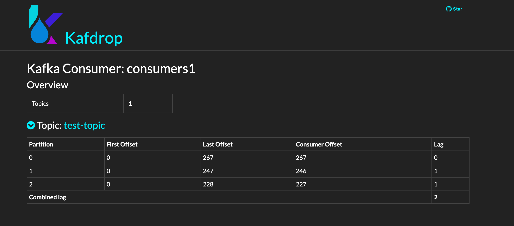

# Burrow Example :)

> ### 1. Create topic from kafdrop


> ### 2. Start producer

```shell
$ curl -XPOST http://localhost:8900/v1/producer/p1?topic=test-topic&interval=100ms | jq .
{
  "metadata": {
    "interval": "100ms",
    "name": "p1",
    "topic": "test-topic"
  },
  "status": "created"
}
```  

> ### 3. Start consumers

```shell
$ curl -XPOST http://localhost:8900/v1/consumer/c1?topic=test-topic&groupId=consumers1 | jq .
{
  "metadata": {
    "groupId": "consumers1",
    "name": "c1",
    "topic": "test-topic"
  },
  "status": "created"
}

$ curl -XPOST http://localhost:8900/v1/consumer/c2?topic=test-topic&groupId=consumers1
$ curl -XPOST http://localhost:8900/v1/consumer/c3?topic=test-topic&groupId=consumers1
```

> ### 4. Check consumers lag from Kafdrop



> ### 5. Force fail to consume at consumer "c1"

```shell
$ curl -XPUT http://localhost:8900/v1/consumer/c1?topic=test-topic&shouldFail=true | jq .
{
  "shouldFail": true
}
```

> ### 6. Notification from Burrow (Open Event)

```json
{
  "block": false,
  "events": [
    {
      "id": "cba45e33-e9c4-45d2-b7bf-2c503ea9c149",
      "event": {
        "severity": "ERR",
        "group": "consumers1",
        "start": "Jun 15, 2021 21:35:25 UTC",
        "complete": 1,
        "partitions": [
          {
            "topic": "test-topic",
            "partition": 1,
            "owner": "/172.21.0.1",
            "client_id": "my-kafka",
            "status": "STOP",
            "start": {
              "offset": 440,
              "timestamp": 1623760446758,
              "observedAt": 1623760480000,
              "lag": 107
            },
            "end": {
              "offset": 456,
              "timestamp": 1623760452011,
              "observedAt": 1623760480000,
              "lag": 91
            },
            "current_lag": 229,
            "complete": 1
          }
        ]
      }
    }
  ]
}
```

> ### 7. Recover consumer

```shell
$ curl -XPUT http://localhost:8900/v1/consumer/c1?topic=test-topic&shouldFail=false | jq .
{
  "shouldFail": false
}
```

> ### 8. Notification from Burrow (Close Event)

```json
{
  "block": false,
  "ids": [
    "cba45e33-e9c4-45d2-b7bf-2c503ea9c149"
  ],
  "start": "2021-06-15 21:35:25.72561 +0900 KST m=+63.348233768"
}
```